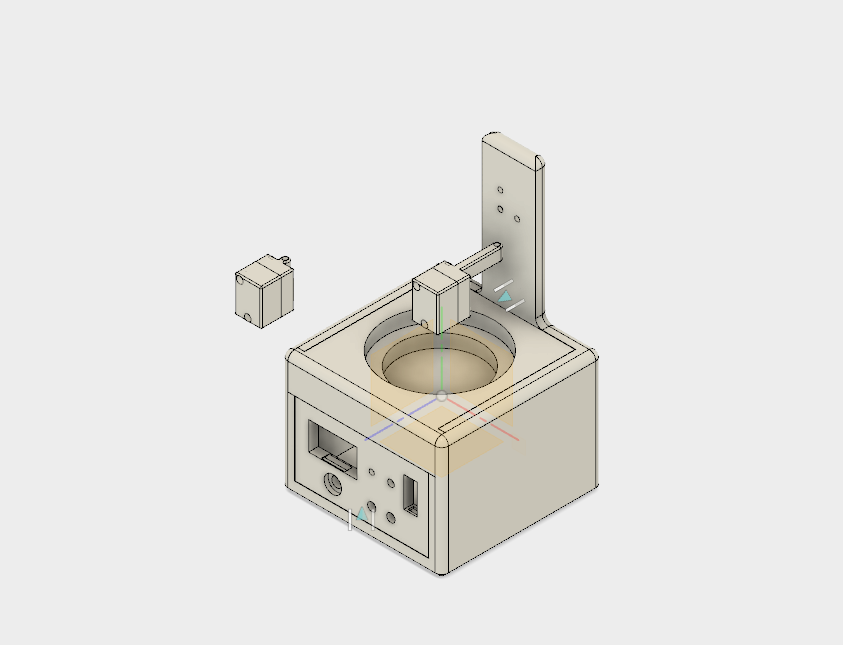

# 4-Point-Probe
The 4 point probe method is used to accurately measure resistance.  This one is for superconductors, so it contains a bath with a large thermal mass for slow heating.  The base contains an adjustable constant current supply along with an ammeter and connection points for a microvolt meter.  The probe head has 4 pogo pins with needle ends (the weak spring in the pin allows for contact without stressing the sample). To prevent arcing silver paint is put on the superconductor at the contact point for the current pins. The thermal mass is a 1'' thick by 3'' diameter piece of copper.  It has a groove to allow a thermocouple to run along the bottom and a small depression to hold the superconducting puck.  A simple push pull toggle clamp is used to move the probe head.

